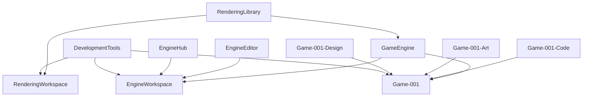

# 依存関係

```mermaid
graph TD
 RL[RenderingLibrary] --> RW[RenderingWorkspace]
 DT[DevelopmentTools] --> RW
 RL --> GE[GameEngine]
 GE --> EW[EngineWorkspace]
 EE[EngineEditor] --> EW
 EH[EngineHub] --> EW
 DT --> EW
 GE --> G[Game-001]
 GC[Game-001-Code] --> G
 GA[Game-001-Art] --> G
 GD[Game-001-Design] --> G
 DT --> G
```

12 direct submodules plus nested RenderingLibrary under GameEngine. Public parents only reference public children.
